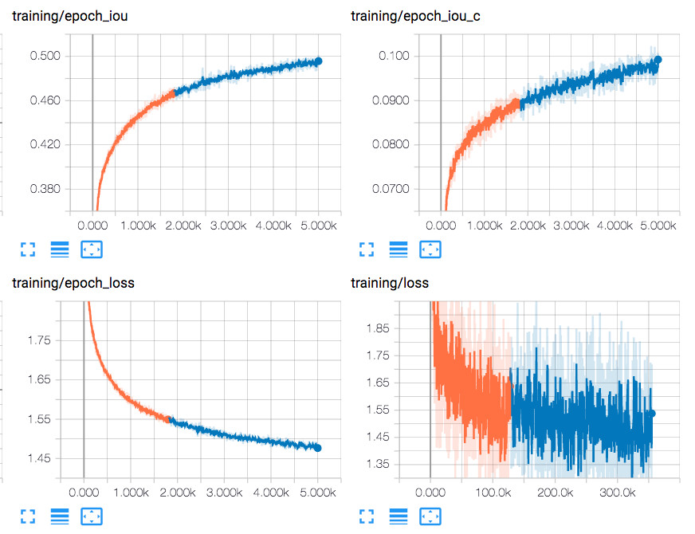
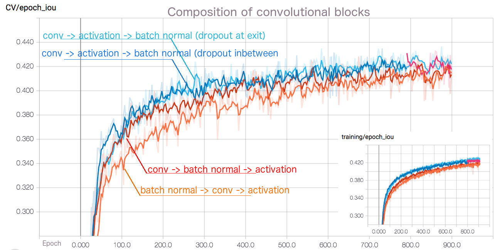
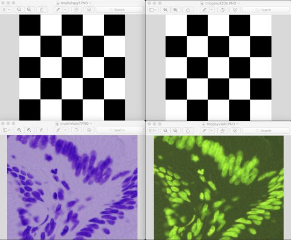
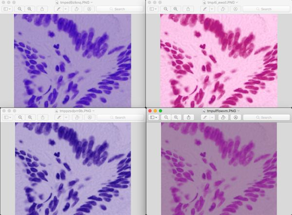
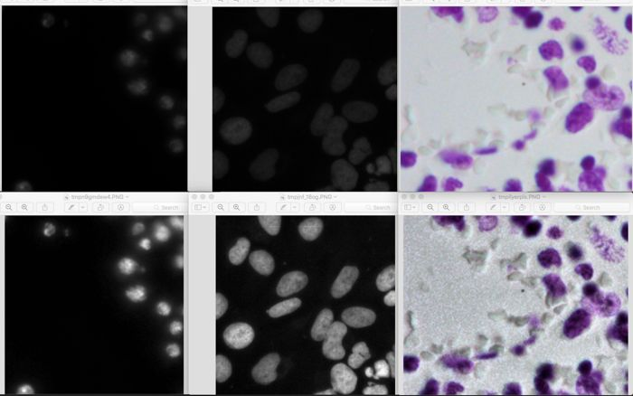
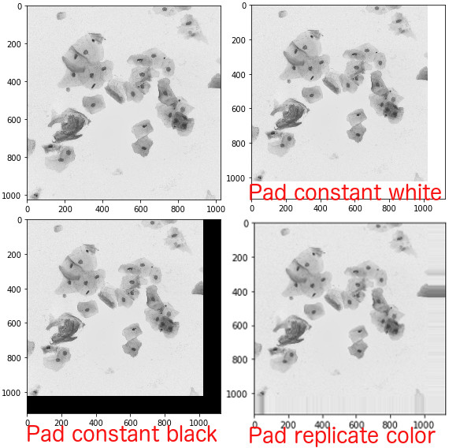

# Description

Kaggle 2018 Data Science Bowl: find the nuclei in divergent images to advance medical discovery

## Development Plan:

* Platform and framework
  - [x] PyTorch
  - [x] macOS
  - [x] Ubuntu
* Explore model architecture
  - [x] UNet
    - [x] Contour Aware model (2 tasks)
    - [x] Contour Aware Marker model (3 tasks)
    - [ ] Boundaries detection for adjacent nuclei only?
  - [x] DCAN (switch to multitask UNet judged bt experimental results)
    - [x] Training efficiency for contour detection
  - [ ] Mask RCNN
  - [ ] Mixed-Scale Dense CNN
  - [x] Dilated Convolution
  - [x] Dropout
  - [x] Batch normalization
  - [x] Transfer learning
  - [x] Score function
  - Cost functions
    + [x] binary cross entropy
    + [x] pixel wise IoU, regardless of instances
    + [x] loss weight per distance of instances's boundary
    + [x] Focal loss (attention on imbalance loss)
    + [ ] Distance transform based weight map
    + [ ] Shape aware weight map
* Hyper-parameter tunning
  - [ ] Learning rate
  - [x] Input size (Tried 384x384, postponed due to slow training pace)
  - [ ] Confidence level threshold
  - [ ] Evaluate performance of mean and std of channels
* Data augmentation
  - [x] Random crop
  - [x] Random horizontal and vertical flip
  - [x] Random aspect resize
  - [x] Random color adjustment
  - [x] Random color invert
  - [x] Random elastic distortion
  - [x] Contrast limited adaptive histogram equalization
  - [x] Random rotate
* Dataset
  - [x] Support multiple whitelist filters to select data type
  - [x] Support manually oversample in advance mode
  - [x] Auto-balance data distribution weight via oversampling
* Pre-process
  - [x] Input normalization
  - [x] Binarize label
  - [x] Cross-validation split
  - [x] Verify training data whether png masks aligned with cvs mask.
  - [x] Blacklist mechanism to filter noisy label(s)
  - [x] Annotate edge as soft label, hint model less aggressive on nuclei edge
  - [x] Whitelist configure option of sub-category(s) for training / validation
  - Prediction datafeed (aka. arbitrary size of image prediction)
    + [x] Resize and regrowth
    + [x] Origin image size with border padding (black/white constant color)
    + [x] Origin image size with border padding (replicate border color)
    + [ ] Tile-based with overlap
  - [ ] Convert input data to CIELAB color space instead of RGB
  - [ ] Use [color map algorithm](https://stackoverflow.com/questions/42863543/applying-the-4-color-theorem-to-list-of-neighbor-polygons-stocked-in-a-graph-arr) to generate ground truth of limited label (4-), in order to prevent cross-talking
* Post-process
  - Watershed segmentation group
    + [x] Marker by statistics of local clustering peak
    + [x] Marker by contour-based from model prediction
    + [x] Marker by marker-based from model prediction
  - Random walker segmentation group
    + [ ] Marker by statistics of local clustering peak
    + [x] Marker by contour-based from model prediction
    + [x] Marker by marker-based from model prediction
  - Ensemble
    + [x] Average probability of pixel wise output of multiple models (or checkpoints)
  - [ ] Fill hole inside each segment group
* Computation performance
  - [x] CPU
  - [x] GPU
  - [x] Multiple subprocess workers (IPC)
  - [x] Cache images
  - [ ] Redundant extra contour loop in dataset / preprocess (~ 50% time cost)
  - [ ] Parallel CPU/GPU pipeline, queue or double buffer
* Statistics and error analysis
  - [x] Mini-batch time cost (IO and compute)
  - [x] Mini-batch loss
  - [x] Mini-batch IOU
  - [x] Visualize prediction result
  - [x] Visualize log summary in TensorBoard
  - [x] Running length output
  - [x] Graph visualization
  - [x] Enhance preduction color map to distinguish color of different nucleis
  - [x] Visualize overlapping of original and prediction nucleis
  - [x] Statistics of per channel data distribution, particular toward alpha
  - [x] Auto save weight of best checkpoint, IoU of train and CV, besides period save.


## Setup development environment

* Install Python 3.6 (conda recommanded)
* Install [PyTorch](http://pytorch.org/)
    ```
    conda install pytorch torchvision -c pytorch
    ```

* Install dependency python packages
    ```
    $ conda install --file requirements.txt
    ```

## Prepare data

Just pick one option to prepare dataset

#### Option A: Use original DSB2018 dataset only

* [Download](https://www.kaggle.com/c/data-science-bowl-2018) and uncompress to `data` folder as below structure,
    ```
    .
    ├── README.md
    └── data
        ├── test
        │   ├── 0114f484a16c152baa2d82fdd43740880a762c93f436c8988ac461c5c9dbe7d5
        │   └── ...
        └── train
            ├── 00071198d059ba7f5914a526d124d28e6d010c92466da21d4a04cd5413362552
            └── ...
    ```

#### Option B: Use external dataset, no filter

* [Download](https://www.kaggle.com/c/data-science-bowl-2018) stage 1 test set and uncompress to `data/test` folder
* [Download](https://drive.google.com/open?id=1UJPwOFLaCS59Al_aYAGtmW5QOH9baLdv) and uncompress to `data/train` folder

#### Option C: Use external dataset, apply white-filter

* At first, follow same procedure as option B
* Download this [Google sheet](https://drive.google.com/open?id=1XEPBBQVuSZmjVXaHRAGRagxO5ewLNelZgg4VF6NqOEE) as CSV (File > Download as > Common-separated values), placed at `data/dataset.csv`
* Configure whitelist filter in `dataset` session of ` config.ini ` (detail refer `config_default.ini`)
    ```
    [train]
    ; enable auto-balance class weight via oversampling
    balance_group = True
    ;
    [dataset]
    ; white-list in dataset.csv, uncomment to enable filter
    csv_file = data/dataset.csv
    source = Kaggle, TCGA
    ```

#### Option D: Manually manage dataset and create fixed CV folder [Advance mode]

* [Download](https://www.kaggle.com/c/data-science-bowl-2018) stage 1 test set and uncompress to `data/test` folder
* Put any training dataset in arbitrary folder, say ` data/stage1_train `
* Run `split.py` to hardlink files into `train` and `valid` folders automatically. (*no extra disk space used*)
    ```
    $ python split.py data/stage1_train
    ```

* Resulting data folder as below, it's safe to delete `train` and `valid`, no impact to original files
    ```
    .
    ├── README.md
    └── data
        ├── test
        │   ├── 0114f484a16c152baa2d82fdd43740880a762c93f436c8988ac461c5c9dbe7d5
        │   └── ...
        ├── train
        │   ├── cc88627344305b9a9b07f8bd042cb074c7a834c13de67ff4b24914ac68f07f6e <────┐
        │   └── ...                                                                   │
        ├── valid                                                                     │
        │   ├── a3a5af03673844b690a48e13ae6594a934552825bd1c43e085d5f88f2856c75d <─┐  │
        │   └── ...                                                                │  │ hardlink
        └── stage1_train                                                           │  │
            ├── a3a5af03673844b690a48e13ae6594a934552825bd1c43e085d5f88f2856c75d ──┘  │
            ├── cc88627344305b9a9b07f8bd042cb074c7a834c13de67ff4b24914ac68f07f6e ─────┘
            └── ...
    ```

### Option E: Manually crop dataset [Advance mode]

* V4 dataset
    - Download [V2](https://drive.google.com/open?id=1UyIxGrVzzo7IUXRJnDRpqT3C_rXOe1s1) and uncompress to `data` folder
    - Download [TCGA no overlap](https://drive.google.com/open?id=1YB_jnDfLpZhnIj0b3wRLiiDrCtb9zNxo) and uncompress to `data` folder
    - Split TCGA to proper scale and prefered data distribution
    ```
    $ cd data
    $ python3 ../crop.py external_TCGA_train --step 200 --width 256
    $ mv external_TCGA_train_split/* source/
    ```

* V6 dataset
    - Git clone [lopuhin Github](https://github.com/lopuhin/kaggle-dsbowl-2018-dataset-fixes) and move `stage1_train` in `data` folder
    - Download [TCGA no overlap](https://drive.google.com/open?id=1YB_jnDfLpZhnIj0b3wRLiiDrCtb9zNxo) and uncompress to `data` folder
    - Split TCGA to proper scale and prefered data distribution
    ```
    $ cd data
    $ python3 ../crop.py external_TCGA_train --step 200 --width 256
    $ mv external_TCGA_train_split/* source/
    ```

* V9 dataset, or just download [here](https://drive.google.com/uc?export=download&id=1KS1E_8U019kA3XSmcFcKJjq3L9A_No0x)
    - Git clone [lopuhin Github](https://github.com/lopuhin/kaggle-dsbowl-2018-dataset-fixes) and move `stage1_train` in `data` folder
    - Download [TCGA no overlap](https://drive.google.com/open?id=1JnYY4og2DdTqcLsUd1F-pTiWYyQSUYES) and uncompress to `data` folder
    - Download [Celltracking](https://drive.google.com/open?id=1hNem6Ob4ZWybHM01_4vy5xBJ6fQ27e9I) and uncompress to `data` folder. Also remove redundant and almost the same images.  
    - Download [v9 CSV]() to `data` folder 
    - Split proper scale and prefered data distribution
        ```
        $ python3 crop.py data/stage1_train  --step 200 --width 256 --csv data/v9.csv
        $ python3 crop.py data/external_TCGA_train_wo_overlap --step 200 --width 256 --csv data/v9.csv
        $ python3 crop.py data/celltracking2kaggle --step 500 --width 512 --csv data/v9.csv
        $ mkdir data/train
        $ mv data/stage1_train_crop/* data/train
        $ mv data/external_TCGA_train_wo_overlap_crop/* data/train
        $ mv data/celltracking2kaggle_crop/* data/train
        ```
    - Further manually add internal data (stitching/overlap) to `data/train` folder

## Hyper-parameter tunning

* Create or modify ` config.ini ` file to overwrite preferences in config_default.ini
    ```
    [param]
    weight_map = True
    model = caunet

    [contour]
    detect = True

    [valid]
    pred_orig_size = True

    [dataset]
    ; ratio of cross-valid
    cv_ratio = 0.1
    ```

## Command line usage

* Train model
    ```
    $ python3 train.py
        usage: train.py [-h] [--resume] [--no-resume] [--epoch EPOCH] [--lr LEARN_RATE]

        Grand new training ...
        Training started...
        // [epoch #][step #] CPU second (io second)     Avg.  batch  (epoch)    Avg. batch (epoch)
        Epoch: [1][0/67]    Time: 0.928 (io: 0.374)	    Loss: 0.6101 (0.6101)   IoU: 0.000 (0.000)
        Epoch: [1][10/67]   Time: 0.140 (io: 0.051)	    Loss: 0.4851 (0.5816)   IoU: 0.000 (0.000)
        ...
        Epoch: [10][60/67]  Time: 0.039 (io: 0.002)	    Loss: 0.1767 (0.1219)   IoU: 0.265 (0.296)
        Training finished...
        ...

    // automatically save checkpoint every 10 epochs
    $ ls checkpoint
        current.json   ckpt-10.pkl
    ```

* Evaluate on test dataset, will show side-by-side images on screen. Specify ` --save ` to save as files
    ```
    $ python3 valid.py
    ```

* Evaluate on cross-validation dataset with ground truth, will show side-by-side images & IoU on screen.
    ```
    $ python3 valid.py --dataset valid
    ```

* Ensemble models, say ` checkpoint/2100.pkl ` and ` checkpoint/best.pkl `
    ```
    $ python3 valid.py checkpoint/2100.pkl checkpoint/best.pkl
    ```

* Generate running length encoding of test dataset
    ```
    $ python3 valid.py --csv
    ```

## Jupyter Notebook running inside Docker container

* ssh to docker host, say ` myhost `
* Launch notebook container, expose port ` 8888 `
    ```
    $ cd ~/Code/DSB2018
    $ docker run --runtime=nvidia -it --rm --shm-size 8G -v $PWD:/mnt -w /mnt -p 8888:8888 rainbean/tensor
        ...
        Copy/paste this URL into your browser when you connect for the first time,
        to login with a token:
            http://localhost:8888/?token=8dae8f258f5c127feff1b9b6735a7cd651c6ce6f1246263d
    ```

* Open browser to url, remember to change hostname from ` localhost ` to real hostname/ip ` myhost `
* Create new notebook tab (New > Python3)
* Train model
    ```Jupyter Notebook
    In [1]: %run train.py --epoch 10

    Loading checkpoint './checkpoint/ckpt-350.pkl'
    Training started...
    Epoch: [350][59/270]	Time: 0.206 (io: 0.085)		Loss: 0.5290 (0.5996)	IoU(Semantic): 0.344 (0.263)
    ```

* Evaluate side-by-side prediction in notebook cell
    ```Jupyter Notebook
    In [2]: %matplotlib inline
    In [3]: %run valid.py
    ```

* Generate csv result
    ```Jupyter Notebook
    In [4]: %run valid.py --csv
    ```

## Benchmark

| LB | DB | Model | Cost Fn. | Epoch | Marker | SA | TP | Learn Rate | CV | Width | PO | Crop | Flip | Invert | Jitter | Distortion | Clahe | Edge Soft Label |
| ----- | ---- | -----  | ---------- | ---- | ------- | -- | -- | ----------- | --- | --- | - | - | - | - | - | - | - | - |
| 0.334 | Orig | UNet   | BCE        | 600  |   |    | .5 | 1e-4 > 3e-5 | 10% | 256 |   | V | V |   | V |   |   |   |
| 0.344 | Orig | UNet   | IOU+BCE    | 600  |   |    | .5 | 1e-4 > 3e-5 | 10% | 256 |   | V | V |   | V | V |   |   |
| (TBA) | Orig | UNet   | IOU+BCE    | 600  |   |    | .5 | 1e-4 > 3e-5 |  0% | 256 |   | V | V |   | V | V |   |   |
| 0.326 | v2   | UNet   | IOU+BCE    | 600  |   |    | .5 | 1e-4 > 3e-5 |  0% | 256 |   |   |   |   |   |   |   |   |
| 0.348 | v2   | UNet   | IOU+BCE    | 300  |   |    | .5 | 1e-4        | 10% | 256 |   | V | V |   | V | V |   |   |
| 0.361 | v2   | UNet   | IOU+BCE    | 600  |   |    | .5 | 1e-4 > 3e-5 |  0% | 256 |   | V | V |   | V | V |   |   |
| 0.355 | v2   | UNet   | IOU+BCE    | 600  |   |    | .5 | 1e-4 > 3e-5 |  0% | 256 |   | V | V |   | V | V | V |   |
| 0.350 | v2   | UNet   | IOU+BCE    | 1200 |   |    | .5 | 1e-4 > 3e-6 |  0% | 512 |   | V | V |   | V | V |   |   |
| 0.353 | v2   | UNet   | IOU+BCE    | 600  |   |    | .5 | 1e-4 > 3e-5 |  0% | 256 |   | V | V |   | V | V |   | V |
| 0.413 | v2   | UNet   | IOU+BCE    | 600  | P | WS | .5 | 1e-4 > 3e-5 |  0% | 256 |   | V | V |   | V | V |   |   |
| 0.421 | v3   | UNet   | IOU+BCE    | 400  | P | WS | .5 | 1e-4 > 3e-5 |  0% | 256 |   | V | V |   | V | V |   |   |
| 0.437 | v3   | UNet   | IOU+BCE    | 900  | P | WS | .5 | 1e-4        |  0% | 256 |   | V | V |   | V | V |   |   |
| 0.447 | v4   | CAUNet | IOU+BCE    | 1800 | C | WS | .5 | 1e-4        |  0% | 256 |   | V | V |   | V | V |   |   |
| 0.460 | v4   | CAUNet | IOU+WBCE   | 900  | C | WS | .5 | 1e-4        |  0% | 256 |   | V | V |   | V | V |   |   |
| 0.465 | v4   | CAUNet | IOU+WBCE   | 1800 | C | WS | .5 | 1e-4        |  0% | 256 |   | V | V |   | V | V |   |   |
| 0.459 | v5   | CAUNet | IOU+WBCE   | 1200 | C | WS | .5 | 1e-4        |  0% | 256 |   | V | V |   | V | V |   |   |
| 0.369 | v5   | CAUNet | IOU+WBCE   | 1200 | C | WS | .8 | 1e-4        |  0% | 256 |   | V | V |   | V | V |   |   |
| 0.477 | v5   | CAUNet | IOU+WBCE   | 1200 | C | WS | .3 | 1e-4        |  0% | 256 |   | V | V |   | V | V |   |   |
| 0.464 | v6   | CAUNet | IOU+WBCE   | 1800 | C | WS | .5 | 1e-4        |  0% | 256 |   | V | V |   | V | V |   |   |
| 0.476 | v6   | CAUNet | IOU+WBCE   | 1800 | C | WS | .3 | 1e-4        |  0% | 256 |   | V | V |   | V | V |   |   |
| 0.457 | v6   | CAUNet | IOU+WBCE   | 1800 | C | WS | .2 | 1e-4        |  0% | 256 |   | V | V |   | V | V |   |   |
| 0.473 | v6   | CAUNet | IOU+WBCE   | 1800 | C | WS | .35| 1e-4        |  0% | 256 |   | V | V |   | V | V |   |   |
| 0.467 | v6   | CAUNet | IOU+WBCE   | 1800 | C | WS | .3 | 1e-4        |  0% | 256 | V | V | V |   | V | V |   |   |
| 0.465 | v6   | CAUNet | IOU+WBCE   | 5000 | C | WS | .5 | 1e-4        |  0% | 256 |   | V | V |   | V | V |   |   |
| 0.480 | v6   | CAUNet | IOU+WBCE   | 5000 | C | WS | .3 | 1e-4        |  0% | 256 |   | V | V |   | V | V |   |   |
| 0.461 | v6   | CAUNet | IOU+WBCE   | 5000 | C | WS | .3 | 1e-4        |  0% | 256 | V | V | V |   | V | V |   |   |
| 0.458 | v6   | CAUNet | IOU+WBCE   | 5000 | C | WS | .5 | 1e-4        |  0% | 256 | V | V | V |   | V | V |   |   |
| 0.435 | Orig | CAUNet | IOU+WBCE   | 1800 | C | WS | .5 | 1e-4        |  0% | 256 |   | V | V |   | V | V |   |   |
| 0.472 | v4   | CAUNet | IOU+WBCE   | 1800 | C | RW | .5 | 1e-4        |  0% | 256 |   | V | V |   | V | V |   |   |
| 0.490 | v6   | CAUNet | IOU+WBCE   | 5000 | C | RW | .3 | 1e-4        |  0% | 256 |   | V | V |   | V | V |   |   |
| 0.469 | v6   | CAUNet | IOU+WBCE   | 5000 | C | RW | .3 | 1e-4        |  0% | 256 | V | V | V |   | V | V |   |   |
| 0.467 | v6   | CAUNet | IOU+Focal  | 1800 | C | WS | .3 | 1e-4        |  0% | 256 |   | V | V |   | V | V |   |   |
| 0.462 | v6   | CAUNet | IOU+Focal  | 1800 | C | WS | .3 | 1e-4        |  0% | 256 | V | V | V |   | V | V |   |   |
| 0.472 | v6   | CAUNet | IOU+Focal  | 1800 | C | RW | .3 | 1e-4        |  0% | 256 |   | V | V |   | V | V |   |   |
| 0.484 | v6   | CAMUNet| IOU+Focal  | 2100 | C | RW | .5 | 1e-4        |  0% | 256 |   | V | V |   | V | V |   |   |
| 0.486 | v6   | CAMUNet| IOU+Focal  | 2100 | C | RW | .5 | 1e-4        |  0% | 256 | V | V | V |   | V | V |   |   |
| 0.498 | v6   | CAMUNet| IOU+F+WBCE | 2100 | C | RW | .3 | 1e-4        |  0% | 256 | V | V | V |   | V | V |   |   |
| 0.488 | v6   | CAMUNet| IOU+F+WBCE | 3760 | C | RW | .3 | 1e-4        |  0% | 256 | V | V | V |   | V | V |   |   |
| 0.479 | v6   | CAUNet | IoU+F+WBCE | 1800 | C | RW | .3 | 1e-4        |  0% | 256 |   | V | V |   | V | V |   |   |
| 0.479 | v6   | CAUNet | IoU+F+WBCE | 1800 | C | RW | .3 | 1e-4        |  0% | 256 | V | V | V |   | V | V |   |   |
| 0.441 | v7   | CAUNet | IoU+F+WBCE | 1800 | C | RW | .3 | 1e-4        |  0% | 256 | V | V | V |   | V | V |   |   |
| 0.498 | v6   | CAMUNet| IoU+Focal2 | 4500 | C | RW | .3 | 1e-4        |  0% | 256 | V | V | V |   | V | V |   |   |
| 0.509 | v6+A1| CAMUNet| IoU+Focal2 | 4800 | C | RW | .3 | 1e-4        |  0% | 256 | V | V | V |   | V | V |   |   |
| 0.527 | v6+A2| CAMUNet| IoU+Focal2 | 5300 | C | RW | .3 | 1e-4        |  0% | 256 | V | V | V |   | V | V |   |   |

Note:
- Dataset (training):
    * V1: original kaggle
    * V2: Feb 06, modified by Jimmy and Ryk
    * V3: V2 + [TCGA](https://nucleisegmentationbenchmark.weebly.com/dataset.html) 256
    * V4: V2 + TCGA 256 (Non overlapped)
    * V5: V2 + TCGA 256 (Non overlapped) + Feb. labeled test set
    * V6: [lopuhin Github](https://github.com/lopuhin/kaggle-dsbowl-2018-dataset-fixes) + TCGA 256 (Non overlapped)
    * V7: V6 + [cell tracking](http://www.celltrackingchallenge.net/datasets.html)
    * A1: 5x2 Jupiter examples
    * A2: A1 + 24 Overlapping/Touching stitching examples
    * V8: Kaggle + TCGA + Cell tracking, without manually cropping
    * V9: Kaggle + TCGA + Cell tracking + Sticking(A1+A2), with manually selection and cropping
- Score is public score on kaggle site
- Zero CV rate means all data were used for training, none reserved
- Adjust learning rate per 300 epoch
- Cost Function:
    * BCE: pixel wise binary cross entropy
    * WBCE: pixel wise binary cross entropy with weight
    * IOU: pixel wise IoU, regardless of instance
    * Focal: Focal loss with pixel wise wise binary cross entropy, weighted by contour
    * Focal2: Focal loss with pixel wise wise binary cross entropy, weighted by contour and centroid
- TP: threshold of prediction probability
- PO (predict origin size): true to keep original test image in prediction phase, otherwise resize as training width
- SA (segmentation algorithm): WS (Watershed), RW (RandomWalker)
- Marker (marker for segmentation):
    * P: local peak max of clustering
    * C: predicted contour of model output

### Learning curve

* Comparison of cost functions

    

* Comparison of composition of convolutional blocks

    The topic of building block of composition of conv. blocks is highly discussed in technical forums and papers. Though it seems not a problem of one-size-fit-all. So here is performance comparison of various popular combinations, the result showed that CAB, `conv -> activation -> batch normal` take lead in benched model ` CAUnet `, in speed and accuracy.

    

### Graph and complexity of models

* Graph
    ```
    To be updated ...
    ```

* Number of model parameters
    - UNet: 1,944,049
    - CAUnet: 2,707,346
    - CAMUnet: 3,470,643

## Known Issues

* Error: multiprocessing.managers.RemoteError: AttributeError: Can't get attribute 'PngImageFile'
    ```
    Reproduce rate:
        1/10
    Root cause:
        PyTorch subprocess workers failed to communicate shared memory.
    Workaround:
        Ignore and issue command again
    ```

* Train freeze or runtime exception running in docker container
    ```
    Root cause:
        PyTorch subprocess worker require enough shared memory for IPC communication.
    Fix:
        Assign --shm-size 8G to reserve enough shared memory
    Example:
        $ docker run --runtime=nvidia -it --rm --shm-size 8G -v $PWD:/mnt -w /mnt rainbean/tensor python train.py
    ```

## Transform effect demo

* Random elastic distortion

    

* Random color invert

    

* Random color jitter

    

* Clahe color equalize

    

* Image border padding: constant vs replicate. Used in origin size prediction.

    

