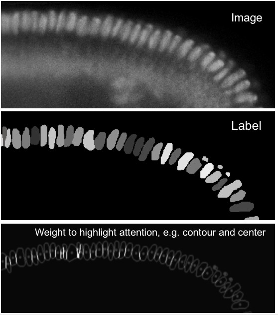
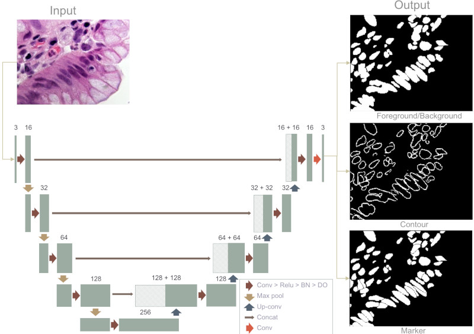
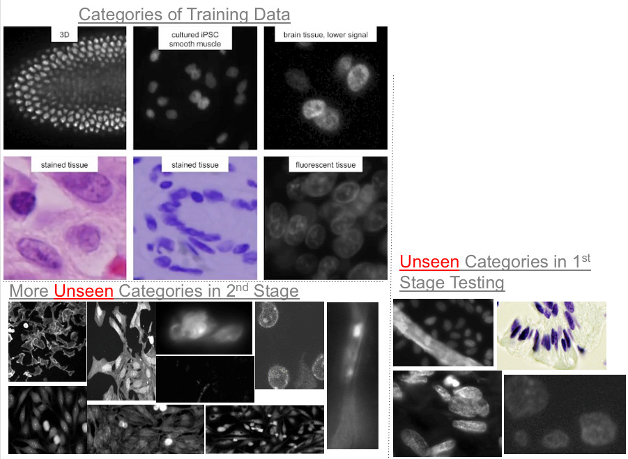
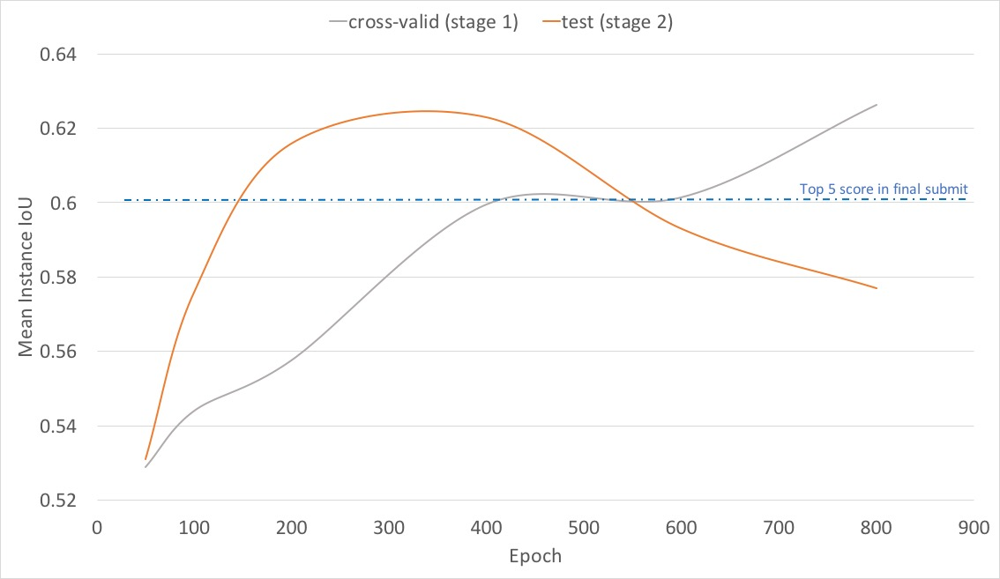

## First Kaggle competition, and first Kaggle sharing

First of all, congrats to the DSB 2018 winners!  This is our first ever Kaggle competition, and we indeed learned so much through out the whole event.  Although our result is not among the best, but we are satisfied with our top 1.5% finish as the first Kaggle attempt.  (Team name: 42) Would like to conclude this journey with the sharing of our learning in hope that it might be useful for future novice contestants like us. We documented our journey in a sequential development log style.  [Github Code] (https://github.com/samuelschen/DSB2018)  

In this competition, we struggled on lack of validation criteria during the stage 2, and ended up submitting worse results than we should.  A few days after the competition deadline, we were able to achieve **0.623** LB score using the same model with the exception of changing to pre-trained ResNet and fixing our broken TTA codes.  I honestly don't think we would have chosen these best results even if we had it before stage 2 ended.  So our question is: how did the leading teams choose which 2 results to submit during stage 2 without knowing the real final test2 dataset?  Would love to hear everyone's opinion.

## Motivation 

After finishing several machine learning online courses and trying out past Kaggle competitions, we are excited about the promise of deep learning. We later decided to participate DSB 2018 in order to benchmark our own capability in machine learning. It led us to participate Data Science Bowl 2018 as our 1st Kaggle competiton.

## The first couple weeks, skeleton and data pipeline 

It's emphasized that 'generalizability' is the key goal of this [competition](https://www.kaggle.com/c/data-science-bowl-2018/). Given the small amount of training set and its diversity, we decided that we'll need lots of data augmentation in data pipeline. Furthermore, easy debugging and integration with existing Python modules would  also be important. PyTorch sounds to us a better choice than TensorFlow for this matter; we decided to use DSB 2018 as our first PyTorch experiment.

Both [MaskRCNN](https://arxiv.org/abs/1703.06870) and [UNet](https://arxiv.org/abs/1505.04597) appear to be reasonable approaches for the segmentation problem.  In favor of its simplicity, we picked **UNet** and built our own code from scratch, also did experiments of data augmentation (random crop, flip, rotate, resize, color jitter, elasitc distortion, color invert, clahe, and gaussian noise). We believed our heavy data augmentation can be helpful in general, but we also learned that some effects did not yield desired improvements, e.g. color invert, clahe, and gaussian noise.

This vanilla UNet produced Public LB score of **0.34**, trained without external dataset, used **Binary Cross-Entropy (BCE)** loss function. Then loss function was changed to **Jaccard/IoU + BCE**, it helped to improve Public LB score to **0.36**.

## One month on model exploration after the first two weeks

Reviewed the output visualization of our vanilla UNet, single binary output obviously not very effective against separating the overlapping nuclei. We started to look for methods to improve vanilla UNet model.

The first idea was transfer learning. A well pre-trained model should mitigate data quantity issue and provide richer low level features as first part of UNet model. We tried VGG16, but unfortunately, no improvement was seen at that time. (note: we revisited transfer learning after competition with the adoption of ResNet)

In early experiments of computer vision morphology algorithms, watershed with peak local max, score reached Public LB **0.41**.   This confirmed that the competition was indeed an instance segmentation problem.

We found the model performed poorly in visualized prediction of histology images, besides model improvement, external datasets were added to training. At this moment Public LB score reached **0.44**

Inspired by [DCAN](https://arxiv.org/abs/1604.02677), we revised the UNet model to be **multitasked**. One head is for semantic prediction, another head is for contour prediction. However, a naive (semantic - contour) as instance segmentation prediction is not good, so we instead used (semantic - contour) as the marker of [watershed algorithm](http://scikit-image.org/docs/dev/auto_examples/segmentation/plot_watershed.html), and it brought the Public LB score to **0.45**

Revisited UNet paper, and felt that using 'weight map' to force the network to learn the border pixels could be helpful, we then implemented a weight map, which emphasizes on borders & centroids (especially for small cells), and it brought us to Public LB **0.47**.

Comparing the partitioning results of watershed and [random walker](http://scikit-image.org/docs/dev/auto_examples/segmentation/plot_random_walker_segmentation.html) for touching objects, we felt that the result of "random walker" was more natural from our perspective.  Changed the post-processing to "random walker", it improved Public LB score to **0.49**.

Reviewed aforementioned markers (semantic - contour) visually, there are always some poor performing cases and it's hard to design rules for them. Therefore, we decided to let the model learn and predict the markers by itself. The third head was added to predict markers, whose ground truths are derived from shrunk cell masks. We used ('markers head' - 'contour head') as the final markers for random walker to partition the 'semantic head'.

In order to address the data imbalance issue, we also implemented [Focal loss](https://arxiv.org/abs/1708.02002) in addition to aforementioned Jaccard/IoU loss function and weight map mechanism. It further improved our Public LB score to **0.50**.

By adding synthesized images of touching/overlapping cells to training set, the Public LB improved to **0.52**, ranked #22 at that moment.

## Struggled in last month or so

We analyzed error cases of stage 1 test data, one of major issues was large cells (scaling), the other one was lack of similar images in Kaggle training dataset 1.

To address scaling issue, we tried to expand the receptive field of UNet's encoder part with "dilated convolution." We found dilated and non-dilated encoder seems to be complement each other well, and we then ensembled these two models by averaging their pixel-wise prediction of three heads.

Back and forth, we spent lots effort in collecting and validating external dataset to be included. With data manipulation, it brought the scrore to Public LB **0.534**, but it's tedious and required some biology knowledge which we didn't have. :-(

Also Test Time Augmentation (TTA) was experimented by horizontal flip, vertical flip, horizontal and vertical flip. However, an implementation error on reflection padding & flip pipeline misled us to drop TTA before end of competition (Ouch! we revisited and fixed TTA after the competition)

## Stage 2 Test Set Released - PANIC mode

Surprised by the huge differences between stage1 and stage 2 test datasets, we panicked!  Several mistakes were made during the final few days, unfortunately.  We added additional BBBC018, BBBC020, and stage 1 test to further train the models.  That was the 1st mistake to put everything in training, resulting no objective local cross validataion to judge overfitting, but relied on human evaluation of visualized predictions. (note: see how we learned after competition)

We thought the longer our model was trained the better score it could be based on the learning curve observed in stage 1, (:facepalm: another mistake mentioned in post-competition), yet it turned out that we chose the worse ones on final submission. Our major struggle in final week was that no validation set similar to the test set (Andrew Ng had a great talk about [Nuts and Bolts of Applying Deep Learning](https://www.youtube.com/watch?v=F1ka6a13S9I) in this regard), so we solely relied on human to evaluate the visualized predictions (and many of them are on-purposed poisoned!).

## Post-Competition Submissions and Reflections

Reading some nice writeups of top winning UNet-based solutions when competition ended (hats off to all winners for sharing!)  Indeed, we had many technical approaches in common, yet a few practices we did not do right or well. For example:

- Data Augmentation: channel shuffle and rgb/gray color space transformation (it didn't show improvement in our experiments somehow)
- Implement TTA correctly, which turns out help the score a lot (Private LB **0.569** -> **0.580**)
- Transfer learning with deep neural network (Resnet), which speed up the training and improved accuracy.
- Try shared decoder and separated decoders for multitasks, and ensemble them for final prediction.

Last but not least, we used stage 1 test set as validation set (totally isolated from training set), and saw the high variance of Private LB score (**0.56** ~ **0.623**) along the training epochs.

The figure suggests that the data distribution of stage 1 test set is likely very different than stage 2 test set, it's somehow like a lottery here since we can't have a reasonable local validation set for stage 2 test set (with tons of on-purposed poison images).   The fluctuation might also hints the number of images used in stage 2 scoring can be relatively small.

Unfortunately, this remains to be a puzzle for us.   We felt a 'generalized' model should perform well on both stage 1 test set and stage 2 test set.  Without an objective validation criteria, we don't believe that we could have chosen our best **0.623** result to be our final submission.

Love to hear from experienced Kagglers for any suggestions/practices in this kind of 2-stage competition!  Good luck to everyone for future Kaggle competitions.

## Reference

If you are interested in our code -
- [Github Code](https://github.com/samuelschen/DSB2018)